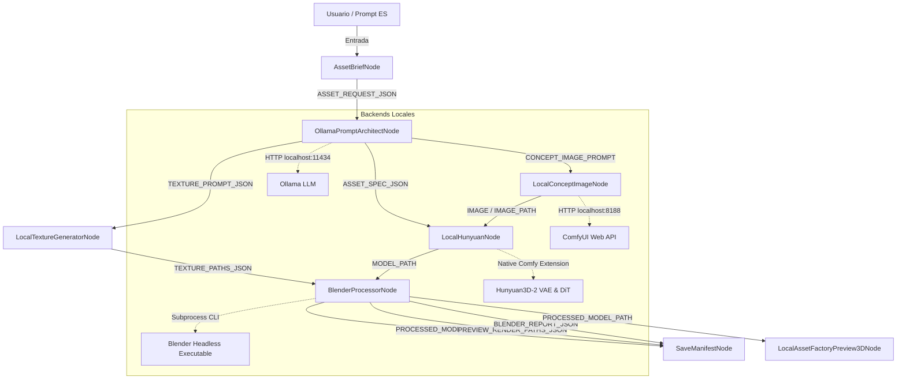

# Guía Completa de Arquitectura, Grafos y Depuración (ChatGPT Debugging Guide)

Este documento contiene el **mapa de arquitectura completo ("Knowledge Graph")**, las especificaciones de todos los nodos de ComfyUI y las instrucciones paso a paso para depurar cualquier falla del sistema desde ChatGPT o cualquier asistente de IA.

---

## 1. Grafo de la Pipeline (System Architecture Graph)

---

## 2. Catálogo Completo de Nodos y Entradas/Salidas

### 1. `AssetBriefNode` (`Asset Factory · Asset Brief`)
- **Propósito**: Captura la descripción e intenciones del usuario en español y los parámetros técnicos (presupuesto de triángulos, plataforma objetivo, resolución).
- **Entradas**:
  - `asset_name` (STRING)
  - `asset_type` (ENUM: `prop`, `weapon`, `architecture`, `vegetation`, `character`, `enemy`, `modular_piece`)
  - `description_es` (STRING multilínea)
  - `visual_style` (ENUM: `low_poly_anime`, `stylized_fantasy`, `hand_painted_anime`, `royal_princess_fantasy`)
  - `gameplay_role` (ENUM: `hero`, `gameplay`, `background`, `modular_environment`)
  - `target_platform` (ENUM: `android_low`, `android_mid`, `android_high`, `ios_mid`, `ios_high`)
  - `triangle_budget` (INT, default: 2500)
  - `texture_resolution` (ENUM: `256`, `512`, `1024`, `2048`)
  - `seed` (INT)
- **Salidas**: `ASSET_REQUEST_JSON` (STRING), `STATUS` (STRING).

---

### 2. `OllamaPromptArchitectNode` (`Asset Factory · Ollama Prompt Architect`)
- **Propósito**: Conecta con Ollama local para transformar la solicitud en una especificación estructurada `AssetSpecification` en inglés.
- **Entradas**:
  - `ASSET_REQUEST_JSON` (STRING forceInput)
  - `model` (STRING, opcional, default: `qwen2.5-coder` / `llama3`)
  - `temperature` (FLOAT: 0.5)
  - `generate_texture_prompts` (BOOLEAN)
- **Salidas**: `ASSET_SPEC_JSON`, `CONCEPT_IMAGE_PROMPT`, `CONCEPT_NEGATIVE_PROMPT`, `TEXTURE_PROMPT_JSON`, `STATUS`.

---

### 3. `LocalConceptImageNode` (`Asset Factory · Local Concept Image`)
- **Propósito**: Genera la imagen conceptual 2D mediante Stable Diffusion a través de la API de ComfyUI.
- **Entradas**: `CONCEPT_IMAGE_PROMPT`, `CONCEPT_NEGATIVE_PROMPT`, `ASSET_SPEC_JSON` (opcional), `width`, `height`, `steps`, `cfg`, `seed`.
- **Salidas**: `IMAGE` (Tensor ComfyUI), `IMAGE_PATH` (STRING), `STATUS`.

---

### 4. `LocalTextureGeneratorNode` (`Asset Factory · Local Texture Generator`)
- **Propósito**: Genera mapas de textura albedo/base_color estilizados.
- **Entradas**: `TEXTURE_PROMPT_JSON`, `ASSET_SPEC_JSON`, `generate_base_color`, `tileable_mode`, etc.
- **Salidas**: `TEXTURE_PATHS_JSON`, `PREVIEW_TEXTURE_IMAGE`, `STATUS`.

---

### 5. `LocalHunyuanNode` (`Asset Factory · Hunyuan3D-2 Image-to-3D`)
- **Propósito**: Convierte imágenes 2D en mallas 3D usando el backend Hunyuan3D-2. Soporta vista única y multi-vista (front, left, back, right).
- **Entradas**: `FRONT_IMAGE`, `LEFT_IMAGE`, `BACK_IMAGE`, `RIGHT_IMAGE` (Tensors o Caminos STRING), `resolution`, `steps`, `mesh_algorithm` (`surface net`, `basic`), `mesh_threshold`.
- **Salidas**: `MODEL_PATH` (.glb / .obj raw), `ALL_OUTPUT_PATHS_JSON`, `STATUS`.

---

### 6. `BlenderProcessorNode` (`Asset Factory · Blender Processor`)
- **Propósito**: Ejecuta Blender en segundo plano (headless) para optimizar la malla (decimación), aplicar materiales/texturas, corregir normales y exportar el GLB final.
- **Entradas**: `MODEL_PATH`, `TEXTURE_PATHS_JSON`, `ASSET_SPEC_JSON`, `optimize_mesh`, `assign_texture`, `generate_previews`, `create_glb`.
- **Salidas**: `PROCESSED_MODEL_PATH`, `PREVIEW_RENDER_PATHS_JSON`, `BLENDER_REPORT_JSON`, `STATUS`.

---

### 7. `SaveManifestNode` (`Asset Factory · Save Manifest`)
- **Propósito**: Compila todos los metadatos de generación en `manifest.json`.
- **Entradas**: Todas las salidas JSON de los nodos anteriores.
- **Salidas**: `MANIFEST_PATH`, `MANIFEST_JSON`, `STATUS`.

---

### 8. `LocalAssetFactoryPreview3DNode` (`Asset Factory · 3D GLB Previewer`)
- **Propósito**: Renderiza un canvas interactivo Three.js/WebGL en la interfaz de ComfyUI para inspeccionar el archivo GLB generado.
- **Entradas**: `model_path` (STRING).
- **Salidas**: Ninguna (UI Output).

---

## 3. Guía de Depuración con ChatGPT

Para depurar un error del sistema desde ChatGPT:

1. **Identifica la etapa en que falló el pipeline**:
   - `Ollama Prompt Architect`: Comprobar si Ollama está corriendo (`http://localhost:11434`).
   - `Local Concept Image`: Comprobar si ComfyUI API responde (`http://127.0.0.1:8188`).
   - `Hunyuan3D-2`: Verificar si hay suficiente VRAM en la GPU o si la resolución VAE supera la memoria.
   - `Blender Processor`: Revisar el archivo `_blender_report.json` o los logs de ejecución headless de Blender.

2. **Copia el mensaje de error o traceback de la consola de ComfyUI**.
3. **Pasa el traceback a ChatGPT indicando la sección afectada de `nodes.py` o `services/`**.

---

## 4. Archivos Clave para Edición y Depuración

- `ComfyUI_windows_portable/ComfyUI/custom_nodes/ComfyUI-LocalAssetFactory/nodes.py` (Lógica principal de nodos)
- `ComfyUI_windows_portable/ComfyUI/custom_nodes/ComfyUI-LocalAssetFactory/schemas.py` (Esquemas Pydantic)
- `ComfyUI_windows_portable/ComfyUI/custom_nodes/ComfyUI-LocalAssetFactory/services/blender_runner.py` (Subproceso Blender)
- `ComfyUI_windows_portable/ComfyUI/custom_nodes/ComfyUI-LocalAssetFactory/blender/process_mesh.py` (Script interno de Blender)
- `ComfyUI_windows_portable/ComfyUI/comfy_extras/nodes_hunyuan3d.py` (Nodos core de Hunyuan3D-2)
