# Arquitectura revisada: pipeline local Hunyuan multiview para personajes 3D móviles

**Proyecto:** `anuaralejandro/txt-timage-to-3d-asset`  
**Decisión arquitectónica:** Hunyuan-first, multiview-first, sin TRELLIS, TripoSR, TripoSG, SkinTokens ni UniRig.  
**Componentes permitidos:** familia Hunyuan publicada, SAM 3.1, Blender y utilidades open source independientes.

---

## 1. Decisión definitiva

La arquitectura correcta para este proyecto no debe tener backends 3D genéricos intercambiables como prioridad. El producto está enfocado en:

- personajes anime o estilizados;
- entrada multivista;
- T-pose o A-pose estricta;
- segmentación por partes;
- low-poly para móvil;
- rigging y animación;
- funcionamiento local;
- un stack controlado y mantenible.

Por tanto, el backbone geométrico será:

```text
Hunyuan3D-2mv
```

y no Hunyuan3D-2.1 estándar.

La distinción es esencial:

- `Hunyuan3D-2mv` está ajustado específicamente para generación de forma controlada por múltiples vistas;
- `Hunyuan3D-2.1` estándar se conserva para `Hunyuan3D-Paint` y tareas de textura;
- `Hunyuan3D-Omni` se usa como generador alternativo o corrector condicionado por pose, bounding box, voxel o point cloud;
- `Hunyuan3D-Part` se usa después de seleccionar la mejor malla para segmentación y descomposición 3D;
- `SAM 3.1` se usa antes de la reconstrucción para máscaras 2D semánticas y validación entre vistas.

No se incluirán:

```text
TRELLIS
TRELLIS.2
TripoSR
TripoSG
SkinTokens
UniRig
```

---

## 2. Diagnóstico del resultado actual

La malla mostrada no es un personaje low-poly defectuoso: es una reconstrucción volumétrica fallida.

Los síntomas son:

- brazos perdidos o fusionados con el torso;
- cabeza y cabello convertidos en una masa;
- pérdida completa de la silueta original;
- piernas desconectadas semánticamente del cuerpo;
- grosor lateral casi inexistente;
- ruido escalonado en toda la superficie;
- prendas, cabello y cuerpo unidos;
- ninguna articulación utilizable;
- topología no deformable;
- imposibilidad de asignar materiales y huesos por parte.

### Causa inmediata de entrada

La imagen frontal aportada usa un PNG RGBA, pero su alfa es completamente opaco. El tablero visible está horneado en RGB, no es transparencia real.

El pipeline debe producir:

```text
FAIL: baked_checkerboard_background
FAIL: no_true_alpha
WARN: insufficient_multiview_coverage
```

antes de ejecutar Hunyuan.

### Causa arquitectónica

El flujo actual se parece a:

```text
imagen
-> Hunyuan
-> decimate
-> UV
-> GLB
```

El flujo requerido es:

```text
multiview validado
-> máscaras 2D
-> reconstrucciones candidatas
-> scoring multivista
-> segmentación 3D
-> retopología por tipo de parte
-> UV y bake
-> texturizado
-> rigging
-> animation QA
-> LOD
-> GLB
```

---

## 3. Stack aprobado

## 3.1 Generación y reconstrucción

| Componente | Función en el pipeline | Estado |
|---|---|---|
| `tencent/Hunyuan3D-2mv` | Backbone principal de geometría multivista | Obligatorio |
| `Tencent-Hunyuan/Hunyuan3D-Omni` | Candidato con control de pose, bbox, voxel o point cloud | Obligatorio para personajes |
| `Tencent-Hunyuan/Hunyuan3D-2.1` | Runtime de shape/paint y base de integración | Obligatorio |
| `Hunyuan3D-Paint` | Textura PBR o fuente high-to-low | Obligatorio después de topología |
| `Tencent-Hunyuan/Hunyuan3D-Part` | Segmentación 3D P3-SAM y descomposición X-Part | Obligatorio |
| `facebookresearch/sam3` con checkpoints 3.1 | Segmentación 2D semántica | Obligatorio |
| `HunyuanImage-3.0-Instruct` o Distil | Texto/imagen a concepto; fase posterior por coste | Opcional |
| Blender | Retopología, UV, bake, rig, QA y export | Obligatorio |
| AutoRemesher / QuadriFlow | Candidato de retopología orgánica | Obligatorio con fallback |
| OpenVDB / Voxel Remesh | Reparación y hard-surface | Obligatorio |
| RigAnything | Auto-rig no comercial para candidato inicial | Opcional |
| Rigify + automatic weights | Rig humanoide determinista | Fallback obligatorio |

## 3.2 Papel exacto de cada modelo

### Hunyuan3D-2mv

Es el generador principal porque acepta un conjunto de vistas. El ejemplo oficial documenta:

```python
image={
    "front": "...",
    "left": "...",
    "back": "..."
}
```

El contrato interno del proyecto puede conservar cuatro vistas:

```text
front
left
back
right
```

pero el adaptador debe consultar las capacidades del checkpoint y alimentar únicamente las claves realmente soportadas. La vista derecha sigue siendo útil para:

- validar consistencia;
- puntuar la reconstrucción;
- detectar asimetrías;
- seleccionar el mejor candidato;
- proyectar máscaras.

No se debe asumir que agregar una clave no documentada será aceptado.

### Hunyuan3D-Omni

No sustituye el backbone multiview. Su función es crear candidatos condicionados:

- `pose`: preservar T-pose;
- `bbox`: bloquear proporciones globales;
- `voxel`: preservar volumen;
- `point`: preservar forma aproximada.

Estrategia recomendada:

```text
Candidato A: Hunyuan3D-2mv
Candidato B: Hunyuan3D-Omni + pose
Candidato C: Hunyuan3D-Omni + voxel derivado de A
```

No se deben fusionar automáticamente las tres mallas. Se renderizan, puntúan y se elige una.

### Hunyuan3D-Part

Se ejecuta sobre la malla seleccionada.

- P3-SAM obtiene características semánticas, segmentos y bounding boxes 3D.
- X-Part reconstruye o completa partes coherentes.

La salida esperada no debe ser un único objeto:

```text
body
hair_front
hair_back
ponytail
top
shorts
belt
skirt_panel
glove_L
glove_R
boot_L
boot_R
accessory_red
```

### SAM 3.1

Se usa para máscaras semánticas en cada vista:

```text
skin/body
hair
face
eyes
top
shorts
belt
skirt panel
left glove
right glove
left boot
right boot
red accessories
```

SAM 3.1 no crea geometría y no sustituye Hunyuan3D-Part. Sus salidas se usan para:

- limpiar fondos;
- separar partes visuales;
- comprobar que una parte existe en varias vistas;
- crear bounding boxes;
- generar mapas de ocupación;
- proyectar etiquetas sobre el mesh;
- puntuar siluetas.

### Hunyuan3D-Paint

Debe ejecutarse después de:

```text
segmentación 3D
-> retopología
-> UV final
-> atlas
```

Pintar una malla raw y remallarla después desperdicia correspondencia, seams y detalle.

---

## 4. Arquitectura objetivo

```mermaid
flowchart LR
    A[Texto o vistas del usuario] --> B[Input Preflight]
    B --> C{Tipo de entrada}

    C -->|Multiview| D[Canonical View Set]
    C -->|Texto/una imagen| E[HunyuanImage Concept Builder]
    E --> D

    D --> F[SAM 3.1 Semantic Masks]
    F --> G[Multiview Consistency Gate]

    G --> H1[Hunyuan3D-2mv Candidate Set]
    G --> H2[Hunyuan3D-Omni Pose Candidate]
    H1 --> H3[Optional Omni Voxel Candidate]

    H1 --> I[Canonical Render and Scoring]
    H2 --> I
    H3 --> I

    I --> J[Selected Raw Mesh]
    J --> K[Hunyuan3D-Part P3-SAM]
    K --> L[X-Part Decomposition]
    L --> M[Per-Part Classifier]

    M -->|Organic deforming| N[Template Wrap + AutoRemesher]
    M -->|Hard surface| O[OpenVDB + Planar Cleanup]
    M -->|Hair/accessory| P[Dedicated Part Strategy]

    N --> Q[Recompose Low-Poly Character]
    O --> Q
    P --> Q

    Q --> R[UV Atlas and High-to-Low Bake]
    R --> S[Hunyuan3D-Paint / Toon Material]
    S --> T[RigAnything Candidate]
    T --> U[Rigify Validation and Fallback]
    U --> V[Animation QA]
    V --> W[LOD and Mobile Optimization]
    W --> X[GLB + Manifest + QC]
```



---

## 5. Arquitectura de software

ComfyUI será una capa visual, no el núcleo.

```text
txt-timage-to-3d-asset/
├── pyproject.toml
├── configs/
│   ├── pipeline/
│   ├── models/
│   ├── quality/
│   ├── mobile/
│   └── licenses/
├── src/local_asset_factory/
│   ├── domain/
│   ├── orchestration/
│   ├── preflight/
│   ├── multiview/
│   ├── segmentation2d/
│   ├── geometry/
│   │   ├── hunyuan2mv.py
│   │   └── hunyuan_omni.py
│   ├── scoring/
│   ├── parts3d/
│   │   └── hunyuan_part.py
│   ├── topology/
│   ├── texturing/
│   │   └── hunyuan_paint.py
│   ├── rigging/
│   ├── animation_qa/
│   ├── optimization/
│   ├── export/
│   └── observability/
├── services/
│   ├── hunyuan3d_2mv/
│   ├── hunyuan3d_omni/
│   ├── hunyuan3d_part/
│   ├── hunyuan3d_paint/
│   ├── sam3_1/
│   ├── hunyuan_image/
│   └── riganything/
├── blender/
│   ├── scripts/
│   ├── templates/
│   └── test_animations/
├── comfyui/
│   └── ComfyUI-LocalAssetFactory/
├── workflows/
├── tests/
├── benchmarks/
└── docs/
```

## 5.1 Servicios aislados

Se requieren entornos separados porque los runtimes no coinciden:

```text
env-hunyuan2mv
env-hunyuan-omni
env-hunyuan-part
env-hunyuan-paint
env-sam3-1
env-hunyuan-image
env-riganything
blender-runtime
```

SAM 3.1 requiere un stack reciente. No debe instalarse dentro del Python portable de ComfyUI.

Cada servicio expone:

```text
GET /health
GET /capabilities
POST /infer
POST /cancel
GET /jobs/{id}
```

o una CLI equivalente.

---

## 6. Contratos de datos

## 6.1 AssetRequest

```yaml
asset_name: jace
asset_type: humanoid_character
style: anime_low_poly
target_platform: android_mid
pose: strict_t_pose
triangle_budget_lod0: 28000
texture_resolution: 2048
views:
  front: input/front.png
  left: input/left.png
  back: input/back.png
  right: input/right.png
```

## 6.2 CanonicalView

Cada vista contiene:

```text
orientation
image_path
mask_path
width
height
subject_bbox
camera_type
camera_yaw
camera_pitch
keypoints_2d
semantic_masks
identity_embedding
sha256
```

## 6.3 GeometryCandidate

```text
backend
checkpoint
revision
seed
input_views
control_type
raw_mesh
render_paths
metrics
warnings
runtime_seconds
peak_vram_mb
```

## 6.4 Part3D

```text
semantic_name
source_faces
mesh_path
confidence
part_class
symmetry_partner
rig_policy
material_policy
topology_policy
```

---

## 7. Pipeline detallado

## Etapa 0 — Preflight

Debe validar:

- alfa real;
- tablero horneado;
- fondo;
- orientación;
- cuerpo completo;
- pose;
- brazos separados;
- piernas separadas;
- resolución;
- similitud entre vistas;
- correspondencia de vestuario;
- escala relativa;
- cámaras.

Gates iniciales:

```yaml
alpha:
  require_true_alpha_or_uniform_background: true
checkerboard:
  reject_baked_pattern: true
pose:
  max_shoulder_angle_error_deg: 5
  max_elbow_flexion_deg: 7
multiview:
  require_front: true
  require_left: true
  require_back: true
  right_view_policy: validation
```

## Etapa 1 — SAM 3.1

Ejecutar segmentación por texto y refinar con boxes/puntos.

No aceptar automáticamente una máscara. Validar:

- área mínima;
- conectividad;
- relación espacial;
- aparición en vistas esperadas;
- simetría;
- solapamiento permitido.

Ejemplo:

```yaml
parts:
  - body
  - hair
  - top
  - shorts
  - gloves
  - boots
  - belt
  - skirt_panel
  - red_accessories
```

## Etapa 2 — Consistencia multivista

Comparar:

- proporción cabeza/cuerpo;
- ancho de hombros;
- ancho de pelvis;
- longitud de extremidades;
- posición de botas;
- volumen de cabello;
- presencia de accesorios;
- paleta de color;
- keypoints.

Si falla:

```text
do_not_generate_3d
```

Primero se corrigen o regeneran las vistas.

## Etapa 3 — Hunyuan3D-2mv

Generar múltiples candidatos del mismo checkpoint:

```yaml
samples:
  seeds: [11, 29, 47, 83]
  inference_steps: [30, 40]
  variants:
    - hunyuan3d-dit-v2-mv
    - hunyuan3d-dit-v2-mv-turbo
```

No usar el checkpoint estándar de 2.1 como si fuera multiview.

## Etapa 4 — Hunyuan3D-Omni

Generar al menos:

```text
pose-controlled candidate
```

Para un personaje T-pose:

- esqueleto canónico;
- proporciones chibi configurables;
- bounding box corporal;
- tamaño de cabeza;
- longitud de brazos;
- separación de piernas.

Opcional:

```text
voxel-controlled candidate
```

a partir de la mejor malla 2mv reparada.

## Etapa 5 — Scoring

Renderizar cada candidato:

```text
front
left
back
right
front_3q
back_3q
top
```

Métricas:

```text
silhouette_iou
semantic_part_iou
keypoint_error
head_body_ratio_error
arm_separation
leg_separation
symmetry
mesh_components
non_manifold_edges
degenerate_faces
normal_consistency
surface_noise
```

Pesos recomendados para personajes:

```yaml
weights:
  semantic_part_iou: 0.25
  silhouette_iou: 0.20
  keypoint_error: 0.15
  pose_accuracy: 0.15
  mesh_health: 0.10
  part_separability: 0.10
  surface_noise: 0.05
```

## Etapa 6 — Hunyuan3D-Part

Aplicar P3-SAM y X-Part.

Objetivo:

- separar partes que deben tener material distinto;
- separar partes rígidas;
- preservar piezas con movimiento secundario;
- obtener boundaries que guíen retopología;
- evitar una malla monolítica.

## Etapa 7 — Clasificación por parte

```text
organic_deforming
organic_rigid
cloth_deforming
cloth_rigid
hair_rigid
hair_secondary_motion
hard_surface
accessory
```

Ejemplo para el personaje:

| Parte | Clase |
|---|---|
| body | organic_deforming |
| hair_front | hair_rigid |
| ponytail | hair_secondary_motion |
| top | cloth_deforming |
| shorts | cloth_deforming |
| skirt_panel | cloth_deforming |
| gloves | cloth_deforming |
| boots | hard_surface |
| belt | hard_surface |
| red_accessories | accessory |

## Etapa 8 — Retopología

### Cuerpo y ropa deformable

No depender solo de AutoRemesher.

Flujo:

```text
repair
-> symmetry
-> template humanoid wrap
-> AutoRemesher/QuadriFlow candidate
-> enforce joint loops
-> shrinkwrap/projection
-> deformation test
```

La plantilla debe permitir perfiles:

```text
normal_anime
chibi_4_heads
chibi_5_heads
```

Loops obligatorios:

- cuello;
- hombro;
- axila;
- codo;
- muñeca;
- pelvis;
- ingle;
- rodilla;
- tobillo.

### Botas y accesorios

```text
voxel repair
-> planar regions
-> hard edge detection
-> limited dissolve
-> bevel
-> weighted normals
-> deterministic triangulation
```

### Cabello

No usar voxel remesh agresivo en mechones.

- preservar silueta;
- separar coleta;
- simplificar planos internos;
- crear pivotes;
- asignar huesos auxiliares si se anima;
- colisión simple con espalda.

## Etapa 9 — UV y bake

```text
final low-poly
-> UV seams
-> atlas
-> bake from selected high mesh
-> seam dilation
-> validation
```

Para móvil:

```text
1 atlas corporal
1 atlas cabello/accesorios como máximo
```

## Etapa 10 — Hunyuan3D-Paint

Dos perfiles:

```text
toon_mobile
pbr_mobile
```

Para el estilo de la referencia se recomienda:

- base color limpio;
- roughness simple;
- normal moderada;
- mask de outline;
- ramp toon en el motor;
- evitar microdetalle PBR que no sobrevivirá en móvil.

## Etapa 11 — Rigging

### Candidato automático

`RigAnything` puede generar esqueleto y skinning en flujo no comercial.

### Fallback y normalización

Rigify:

1. colocar meta-rig usando keypoints y bounding boxes 3D;
2. generar rig;
3. parent con automatic weights;
4. corregir pesos;
5. añadir huesos de cabello y faldón;
6. exportar solo huesos deformantes.

La salida final debe usar un esqueleto estable del proyecto, aunque RigAnything proponga otro.

## Etapa 12 — Animation QA

Animaciones obligatorias:

```text
idle
walk
run
jump
crouch
arms_up
arms_forward
elbow_bend
deep_knee_bend
torso_twist
```

Fallar si existe:

- vértice sin peso;
- influencia superior al límite;
- colapso grave en axila/ingle;
- penetración de coleta;
- botas deformándose como piel;
- faldón unido a la pierna incorrecta;
- volumen perdido;
- normales invertidas.

## Etapa 13 — Mobile optimization

Perfil inicial:

```yaml
android_mid_character:
  lod0_triangles: 28000
  lod1_triangles: 14000
  lod2_triangles: 6500
  lod3_triangles: 2200
  max_materials: 2
  max_vertex_influences: 4
  max_deform_bones: 75
  texture_lod0: 2048
  texture_lod1: 1024
  compression: ktx2
```

---

## 8. Estrategia de candidatos sin TRELLIS ni Tripo

La diversidad no tiene que venir de proveedores diferentes. Puede obtenerse con:

- seeds;
- variantes normal/turbo;
- pasos;
- thresholds;
- Hunyuan3D-2mv;
- Hunyuan3D-Omni pose;
- Hunyuan3D-Omni voxel;
- diferentes paquetes multivista corregidos.

Matriz:

| Candidato | Modelo | Condición |
|---|---|---|
| A1–A4 | Hunyuan3D-2mv | varias seeds |
| B1–B2 | Hunyuan3D-2mv Turbo | varias seeds |
| C1–C2 | Hunyuan3D-Omni | pose |
| D1 | Hunyuan3D-Omni | voxel de mejor A |

Esto evita depender de TRELLIS/Tripo y conserva un ensemble real.

---

## 9. Gates de calidad

## Input

- [ ] Fondo limpio.
- [ ] Alfa real o fondo uniforme.
- [ ] Sin tablero horneado.
- [ ] Vistas consistentes.
- [ ] T-pose dentro de tolerancia.
- [ ] Brazos y piernas visibles.

## Raw geometry

- [ ] Silueta aceptable en cuatro vistas.
- [ ] Cabeza presente.
- [ ] Brazos presentes y separados.
- [ ] Piernas presentes y separadas.
- [ ] Cabello reconocible.
- [ ] Sin ruido volumétrico severo.
- [ ] Sin caras degeneradas.

## Parts

- [ ] Partes semánticas nombradas.
- [ ] Coleta separada.
- [ ] Botas separadas.
- [ ] Guantes identificados.
- [ ] Ropa y cuerpo diferenciados.
- [ ] Confianza registrada.

## Topology

- [ ] Presupuesto de triángulos.
- [ ] Loops de articulación.
- [ ] Hard edges correctos.
- [ ] Sin microcomponentes.
- [ ] Malla manifold final.
- [ ] Deformación validada.

## Rig

- [ ] Ningún vértice sin peso.
- [ ] Suma de pesos válida.
- [ ] Máximo cuatro influencias.
- [ ] Jerarquía válida.
- [ ] Esqueleto normalizado.
- [ ] Huesos auxiliares controlados.

## Export

- [ ] GLB válido.
- [ ] LOD incluidos.
- [ ] Texturas KTX2 o fuente convertible.
- [ ] Clips de prueba.
- [ ] Manifest.
- [ ] QC report.
- [ ] Reimportación en Blender.
- [ ] Smoke test en motor.

---

## 10. Roadmap revisado

### Fase 0 — Recuperar implementación real

- versionar custom nodes;
- versionar scripts Blender;
- eliminar rutas absolutas;
- congelar resultado actual.

### Fase 1 — Multiview y preflight

- true alpha;
- checkerboard detector;
- canonical views;
- SAM 3.1;
- consistency gate.

### Fase 2 — Geometría Hunyuan

- Hunyuan3D-2mv;
- candidate batch;
- Hunyuan3D-Omni pose;
- scoring.

### Fase 3 — Segmentación y topología

- Hunyuan3D-Part;
- P3-SAM;
- X-Part;
- template wrapping;
- AutoRemesher;
- OpenVDB.

### Fase 4 — Textura y rig

- UV/bake;
- Hunyuan3D-Paint;
- RigAnything;
- Rigify;
- animation QA.

### Fase 5 — Producción móvil

- LOD;
- KTX2;
- draw-call budgets;
- GLB validation;
- benchmarks.

### Fase 6 — Texto a paquete multivista

- HunyuanImage-3.0-Instruct/Distil;
- generación de vista frontal;
- derivación de laterales/posterior;
- SAM 3.1 consistency;
- regeneración automática cuando falle.

---

## 11. Decisiones finales

1. El backbone multiview es `Hunyuan3D-2mv`.
2. Hunyuan3D-2.1 estándar no se presenta como backend multiview.
3. Hunyuan3D-Omni se usa para pose y control geométrico.
4. SAM 3.1 segmenta las referencias 2D.
5. Hunyuan3D-Part segmenta y recompone partes 3D.
6. Hunyuan3D-Paint se ejecuta después de topología y UV.
7. No se incluyen modelos o runtimes de Tripo.
8. No se incluye TRELLIS.
9. La retopología de personaje usa plantilla más AutoRemesher, no simple decimation.
10. RigAnything es candidato no comercial; Rigify es fallback determinista.
11. La primera malla nunca se exporta automáticamente.
12. ComfyUI queda como UI y orquestador visual.

---

## 12. Fuentes primarias

- Hunyuan3D-2mv: `https://huggingface.co/tencent/Hunyuan3D-2mv`
- Hunyuan3D-2.1: `https://github.com/Tencent-Hunyuan/Hunyuan3D-2.1`
- Hunyuan3D-Omni: `https://github.com/Tencent-Hunyuan/Hunyuan3D-Omni`
- Hunyuan3D-Part: `https://github.com/Tencent-Hunyuan/Hunyuan3D-Part`
- SAM 3 / 3.1: `https://github.com/facebookresearch/sam3`
- HunyuanImage-3.0: `https://github.com/Tencent-Hunyuan/HunyuanImage-3.0`
- RigAnything: `https://github.com/Isabella98Liu/RigAnything`
- Blender Rigify: `https://docs.blender.org/manual/en/latest/addons/rigging/rigify/`
- Blender retopology: `https://docs.blender.org/manual/en/latest/modeling/meshes/retopology.html`
- AutoRemesher: `https://github.com/huxingyi/autoremesher`

---

## 13. Nota de licencia

El diseño técnico no depende de uso comercial. Aun así, el manifest debe registrar la licencia y revisión de cada checkpoint. Que un repositorio o peso sea descargable públicamente en Hugging Face no equivale necesariamente a una licencia OSI.

Para este proyecto se propone:

```text
license_mode: private_noncommercial_research
```

El sistema mostrará el aviso y guardará aceptación, pero la decisión de uso corresponde al operador.
